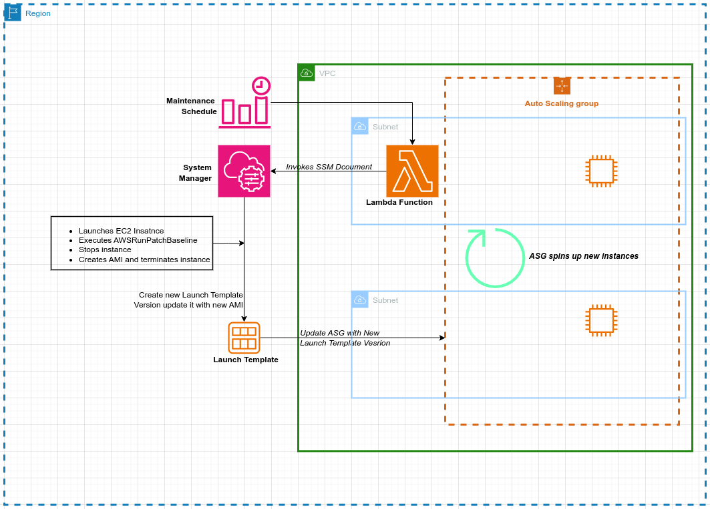

# aws-autoscaling-group-patching
The auto-scaling patching solution automates the installation of patches on EC2 servers managed by the AWS Auto Scaling service. It addresses the challenge of ensuring that servers created by the auto-scaling group have the latest patches installed.

## Solution Overview
The patching solution is designed using AWS Lambda, CloudWatch, and Systems Manager services. Systems Manager maintains the document used for patching and the maintenance window schedule. The SSM document is created using an AWS Auto Scaling patching blueprint, which can be found in the following [link.](https://docs.aws.amazon.com/systems-manager/latest/userguide/automation-tutorial-update-patch-windows-ami-autoscaling.html)

The Lambda function is responsible for invoking the SSM document. It passes the necessary Auto Scaling details to the document during invocation. AWS CloudWatch is used to store the logs.

The maintenance window schedules the execution of the Lambda function, which, in turn, invokes the SSM document. The SSM document contains a YAML script responsible for creating a new standalone EC2 instance. It proceeds to install patches on the instance, stops the instance, and creates a new AMI from it. The instance is terminated after the AMI has been created.

Next, it updates the auto scaling group's launch template by creating a new launch template version and configuring it to use the latest AMI. Subsequently, it configures the auto scaling group to use the new launch template version instead of the old one. 




 

## Technologies Used
The solution was built using the following technologies:

* Git
* Terraform
* Python
* YAML
* AWS Lambda
* AWS IAM
* AWS CloudFormation
* AWS CloudWatch
* AWS Systems Manager


```hcl
module "ssm_asg_patching" {
  source = "./"

  vpc_id                   = module.networking.grtz_vpc_id
  lambda_subnet_ids        = module.networking.private_subnets
  lambda_asg_env_variables = local.asg_patching
}
```